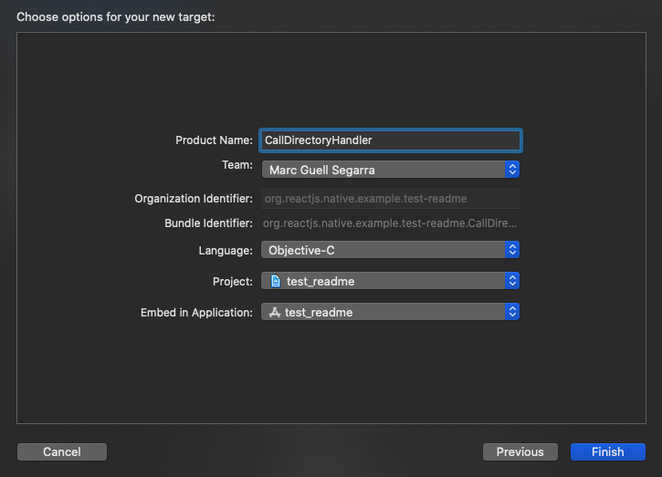
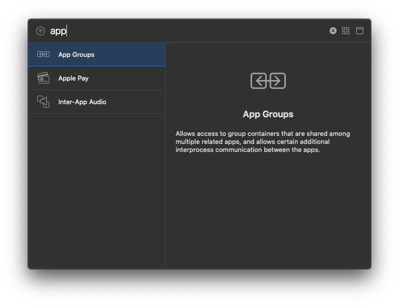

# iOS specific installation steps

Once you have successfully installed this package via yarn or npm you should follow these steps:

## 1. Add Call Directory Extension target to your iOS project

First, you should open your workspace project with Xcode and add a new Call Directory extension target. For this we should click on the plus button marked with a red oval in this image:


Select Call Directory extension:


Now it's time to enter call directory extension product name. You can for instance enter `CallDirectoryHandler`. Note that field called **Bundle identifier** will be our `extensionId` for later reference.



Once we click finish, Xcode will create boilerplate code in our iOS project in a folder called `CallDirectoryHandler`.

## 2. Add app groups

Now we have to add both app target and extension target in the same app group. This is because we have to share the caller ID's data between app and extension parts. For this, we must add the same app group in both targets.

Let's do it by changing into **Signing and Capabilities** for every target:


And clicking the **+ Capability** button on the top left. A dialog will appear, and we must select **App groups**:



A new section will appear, like this:


Now we have to create a new group clicking on the plus button. This will be an unique identifier that our app target and extension target will share in order to use the caller id data stored in the phone storage.

We can enter for instance `group.mguellsegarra_callerid` when Xcode asks for it and later enable it by clicking the checkbox. We'll be using this identifier in our code later.


Repeat the steps for the app target, this is the one with the same name of your project:


## 3. Env file and run update script

Create a `.env` file in your root of RN project, and change the values to fit your needs:

```
IOS_DATA_KEY=CALLER_LIST
IOS_APP_GROUP=group.mguellsegarra_callerid
IOS_EXTENSION_FILEPATH=./ios/CallDirectoryHandler/CallDirectoryHandler.m
```

You can leave `IOS_DATA_KEY` as it is, or change it if you want to use a different key to store `NSUserDefaults` data. Adjust also `IOS_EXTENSION_FILEPATH` if you changed it in Xcode default settings.

Now you can run the handy script to do the magic:

```
example $ node node_modules/ondori-caller-id/scripts/update_ios_extension.js
```

This script will automagically update `CallDirectoryHandler.m` in order to change `DATA_KEY` and `APP_GROUP`. Use it whenever you change these values in Xcode.

## 4. Add the extension target in the Podfile

Now time to edit the Podfile placed inside our ios project folder. We should add this lines in order to enable the extension target in our build:

Place them after `platform :ios...` line:

```
target 'CallDirectoryHandler' do
end
```

And then your Podfile should be like this:

```
require_relative '../node_modules/react-native/scripts/react_native_pods'
require_relative '../node_modules/@react-native-community/cli-platform-ios/native_modules'

platform :ios, '10.0'

target 'CallDirectoryHandler' do
end

target 'caller_id' do
## ....
end
```

## 5. Run pod install

Now we should run `pod install` iniside our iOS project folder:

```
$ pod install
Auto-linking React Native module for target `test_readme`: ONDCallerId
Analyzing dependencies
Downloading dependencies
Installing ONDCallerId (0.0.1)
Generating Pods project
Integrating client project
Pod installation complete! There are 48 dependencies from the Podfile and 39 total pods installed.
```

And we're ready to go. Done with Xcode setup.
